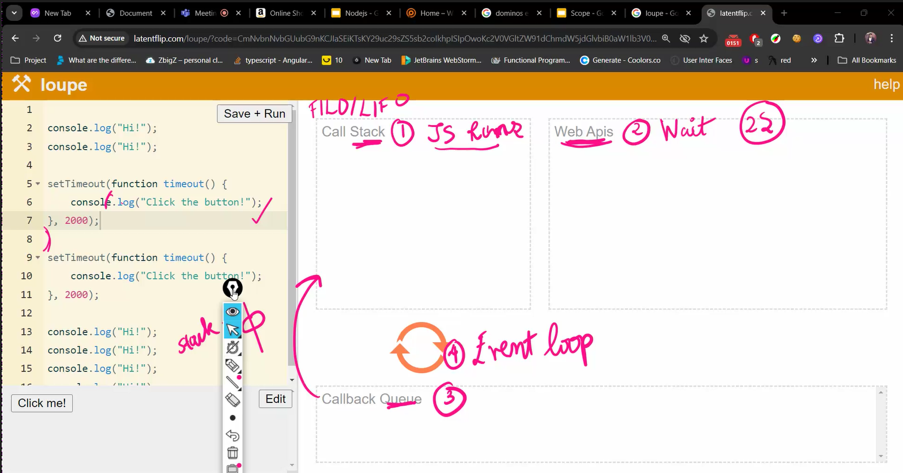

# 18th July

- setTimeout() is not part of js , it is part of browser

```js
// 1.Timer
setTimeout(() => {
    console.log("hello);
},5000)
// Action -> Reaction
// Action has to complete -> Triggers another action
```

 // Event Loop

- for loop code is blocking code it blocks the async code to execute
- If the code in call stack then we can see in screen

> Promise

- there are three states

1. pending
2. fulfilled
3. rejected

- only when resolve happens .then will happen => refer promise.js file
- .then returns Promise object
- console.log returns nothing (undefined)


promise.all 
- 1. waits till all promise complete 
2. anyone errors | goes to catch block

promise.race
1.waits 